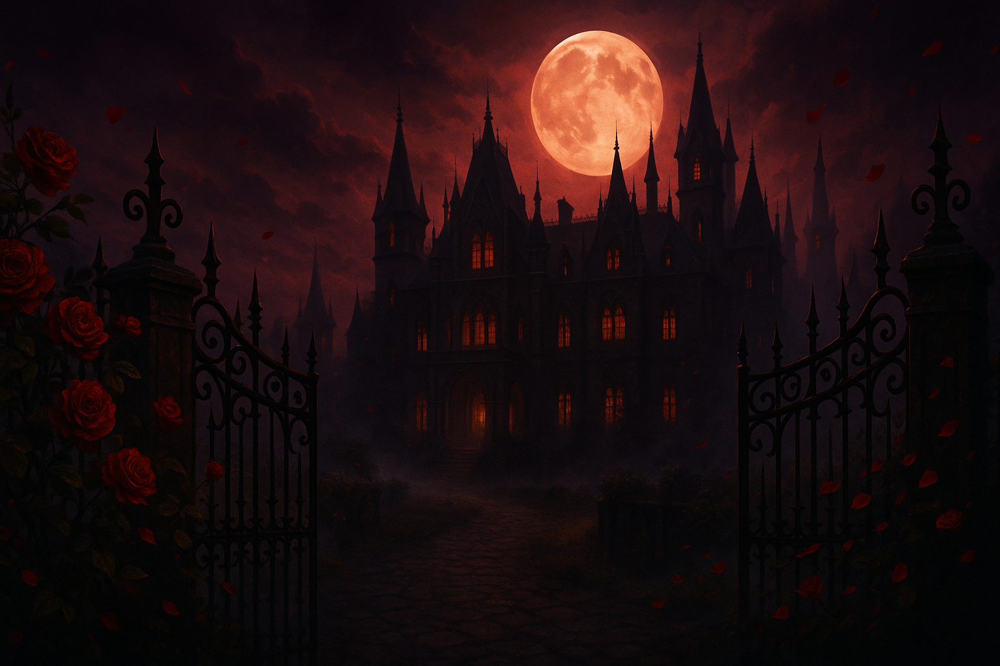

# 🧛‍♀️ Eternal Hearts: A Ravencroft Romance

A sophisticated sapphic vampire romance visual novel where you inherit the mysterious Ravencroft Manor and discover a world of immortal passion, ancient secrets, and choices that determine your eternal fate. Navigate complex political tensions, unlock character backstories, and manage your sanity while building relationships with a diverse coven of supernatural beings.



## ✨ Features

- **Multi-Chapter Storyline**: Two complete chapters with political faction conflicts and intimate character development
- **9 Unique Companions**: Diverse vampire characters plus cosmic entity with deep backstories and relationship paths
- **Character Creation System**: Traits, flaws, and boons that actively modify gameplay choices and outcomes
- **Health & Sanity Management**: Strategic resource management with recovery actions and consequences for forbidden knowledge
- **Journal & Achievement System**: Track your choices, relationships, and unlock 21 achievements across 4 categories
- **Character Backstory Unlocks**: Intimate scenes revealed based on affection and trust levels
- **Political Faction Dynamics**: Navigate tensions between progressive revolutionaries and traditional aristocrats
- **Recovery Actions System**: Restore health and sanity through rest, meditation, and character interactions
- **Professional Gothic Artwork**: 8 atmospheric background locations with immersive visual storytelling
- **Trust & Reputation System**: Hidden trust mechanics that can lead to exile or death without visual warnings
- **Adaptive Storytelling**: Dynamic hints based on choice patterns, relationship focus, and story momentum
- **Cross-Platform Distribution**: Standalone launchers for Windows, macOS, and Linux

## 🎭 Characters

Meet the diverse supernatural beings at Ravencroft Manor:

### Core Vampire Coven
- **Lilith** - Ancient Mesopotamian queen and coven leader with millennia of wisdom and unmatched authority
- **Morgana** - Salem-era shadow witch with mastery over darkness and forbidden magic
- **Seraphina** - Fallen angel cast out for excessive compassion, retaining divine grace and healing powers

### The New Generation
- **Valentina** - French Revolution-era progressive fighting for vampire modernization and social reform
- **Celeste** - Renaissance scholar and keeper of ancient knowledge, advisor to the coven's decisions
- **Raven** - Former vampire hunter turned protector, conflicted by her violent past and current loyalty
- **Isadora** - Victorian-era aristocrat and traditionalist socialite with hidden political machinations
- **Elena** - Austrian composer whose musical genius was stolen by history, seeking artistic vindication
- **Luna** - Enigmatic moon seer with prophetic abilities and connections to celestial forces

### Cosmic Entity
- **Umbra** - Shy eldritch horror in starlight constellation form, requiring Mental Fortitude and Iron Will to romance safely

## 🚀 Quick Start

### Development Setup

1. **Clone the repository**
   ```bash
   git clone https://github.com/yourusername/eternal-hearts-ravencroft-romance.git
   cd eternal-hearts-ravencroft-romance
   ```

2. **Install dependencies**
   ```bash
   npm install
   ```

3. **Set up the database**
   ```bash
   npm run db:push
   ```

4. **Start the development server**
   ```bash
   npm run dev
   ```

5. **Open your browser** to `http://localhost:5000`

### Standalone Distribution

For end users who want to play without setting up a development environment:

1. Download `Eternal-Hearts-Ravencroft-Romance-Final.tar.gz`
2. Extract all files to a folder
3. Navigate to your platform folder and double-click the launcher:
   - **Windows**: `windows/Start Game.bat`
   - **macOS**: `macos/Start Game.command`
   - **Linux**: `linux/Start Game.sh`
   - **Universal**: `universal/Start Game.sh` (works on any platform)

**Requirements**: Node.js (download from [nodejs.org](https://nodejs.org))

## 🛠️ Technology Stack

### Frontend
- **React** with TypeScript for the user interface
- **Vite** for fast development and optimized builds
- **Tailwind CSS** with custom gothic theme
- **Shadcn/ui** components built on Radix UI primitives
- **TanStack Query** for server state management
- **Wouter** for lightweight client-side routing

### Backend
- **Express.js** with TypeScript for the API server
- **PostgreSQL** with Drizzle ORM for type-safe database operations
- **Neon** serverless PostgreSQL with connection pooling
- **Session management** with connect-pg-simple

### Distribution
- **Cross-platform launchers** for Windows, macOS, and Linux
- **Embedded HTTP server** for standalone deployment
- **Self-contained packages** requiring only Node.js runtime

## 📁 Project Structure

```
├── client/                 # Frontend React application
│   ├── src/
│   │   ├── components/     # Reusable UI components
│   │   ├── pages/          # Application pages
│   │   ├── contexts/       # React context providers
│   │   ├── data/           # Game data and character definitions
│   │   └── types/          # TypeScript type definitions
├── server/                 # Backend Express application
│   ├── routes.ts           # API route definitions
│   ├── storage.ts          # Database abstraction layer
│   └── db.ts              # Database connection setup
├── shared/                 # Shared code between client and server
│   └── schema.ts          # Database schema and types
├── attached_assets/        # Game artwork and backgrounds
└── game-distribution/     # Cross-platform distribution packages
```

## 🎮 Gameplay Features

### Character Creation & Development
- **Traits**: Physical, social, and mental characteristics that unlock special purple-styled dialogue options
- **Flaws**: Character weaknesses that trigger random penalties and vulnerability mechanics
- **Boons**: Special abilities including Mental Fortitude (50% sanity reduction) and Iron Will (25% health/sanity reduction)
- **Trait Combinations**: Certain boon combinations unlock hidden content like Umbra romance path

### Advanced Systems
- **Dual Relationship Tracking**: Monitor both affection and trust levels with visual color-coded indicators
- **Health & Sanity Management**: Strategic resource management with consequences for forbidden knowledge and cosmic exposure
- **Journal System**: Comprehensive tracking of choices, relationship changes, and story events with timestamps
- **Achievement System**: 21 unlockable achievements across Story, Relationship, Exploration, and Survival categories
- **Recovery Actions**: Restore health/sanity through basic rest, meditation, and character-specific social recovery options

### Political & Story Mechanics
- **Chapter 2 Faction Conflicts**: Navigate tensions between Valentina's progressives and Isadora's traditionalists
- **Advisory Consultations**: Seek guidance from Lilith and Celeste for informed decision-making
- **Character Backstory Unlocks**: Intimate scenes revealed when affection and trust thresholds are met
- **Trust-Based Consequences**: Hidden mechanics where investigating forbidden topics can lead to exile or death
- **Adaptive Storytelling**: Dynamic hints analyzing choice patterns, character focus, and relationship momentum

### Visual Novel Elements
- **Professional Gothic Artwork**: 8 atmospheric backgrounds (manor entrance, grand hall, library, music room, garden, dining hall, bedroom, ballroom)
- **Immersive Atmosphere**: Background images displayed behind story text with location-appropriate imagery
- **Calligraphic Typography**: Authentic quill pen aesthetic with Great Vibes, Dancing Script, and Alex Brush fonts
- **1,565+ Story Scenes**: Complete narrative coverage with perfect branching structure and zero orphaned pathways

## 🔧 Development

### Available Scripts

- `npm run dev` - Start development server
- `npm run build` - Build for production
- `npm run start` - Start production server
- `npm run check` - Run TypeScript checks
- `npm run db:push` - Push database schema changes

### Building Distribution Packages

```bash
npm run build
cd game-distribution && tar -czf ../Eternal-Hearts-Ravencroft-Romance-Final.tar.gz windows/ macos/ linux/ universal/
```

This creates a complete standalone package with cross-platform launchers in `game-distribution/`.

## 🎨 Customization

### Adding New Characters
1. Define character data in `client/src/data/gameData.ts`
2. Add character relationships and interactions
3. Create character-specific story scenes
4. Update the character selection and affection systems

### Creating New Scenes
1. Add scene definitions to the appropriate chapter in `gameData.ts`
2. Include background assignments for atmosphere
3. Define character interactions and choice consequences
4. Test story flow and choice validation

### Modifying the UI
- Components are in `client/src/components/`
- Styling uses Tailwind CSS with custom gothic theme variables
- UI primitives from Shadcn/ui can be customized in `client/src/components/ui/`

## 📊 Database Schema

The game uses PostgreSQL with the following main tables:

- **users**: Player accounts and authentication
- **game_states**: Saved game progress and state data

Database operations are handled through Drizzle ORM with full type safety.

## 🤝 Contributing

1. Fork the repository
2. Create a feature branch (`git checkout -b feature/amazing-feature`)
3. Commit your changes (`git commit -m 'Add amazing feature'`)
4. Push to the branch (`git push origin feature/amazing-feature`)
5. Open a Pull Request

## 📝 License

This project is licensed under the MIT License - see the [LICENSE](LICENSE) file for details.

## 🙏 Acknowledgments

- Inspired by classic vampire romance literature
- Built with modern web technologies for optimal performance
- Designed for the sapphic community with authentic representation
- Art and design focused on gothic atmosphere and romantic storytelling

## 📞 Support

If you encounter issues or have questions:

1. Check the [Issues](https://github.com/yourusername/eternal-hearts-ravencroft-romance/issues) page
2. Review the troubleshooting section in the standalone distribution README
3. Create a new issue with detailed information about the problem

---

*Enter the shadows of Ravencroft Manor and discover your eternal destiny...* 🌹